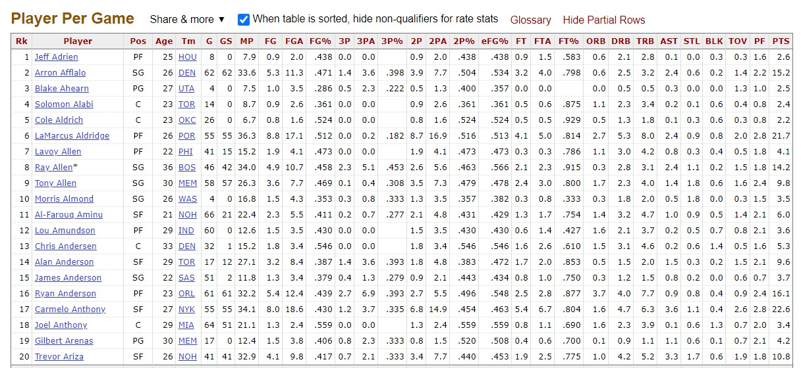
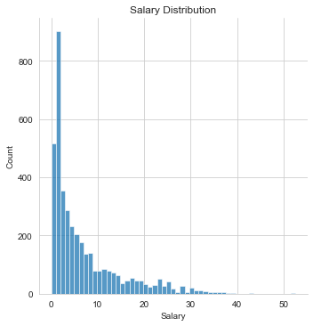
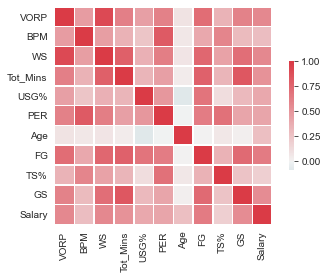

# NBA-Salary-Prediction

## Summary:
- Built tool to estimate NBA player salaries based only on readily-available statistics
- Used Beautiful Soup and Pandas to webscrape, clean and consolidate 9 seasons of statistics and salary data into one dataset
- Compared different regression models (Linear, Lasso, Random Forest, XGBoost) to minimize Mean Absolute Error (MAE)
- Chose a Random Forest model tuned using RandomizedSearch as the best performing model (MAE = $2.6 mil)
- Future work could incorporate more advanced performance statistics and/or intangible factors to make better predictions 

## References:
- [basketball-reference for player statistics](https://www.basketball-reference.com/)
- [ESPN for player salaries](http://www.espn.com/nba/salaries)
- [Great primer on XGBoost](https://towardsdatascience.com/https-medium-com-vishalmorde-xgboost-algorithm-long-she-may-rein-edd9f99be63d)

### Motivation:
As an avid NBA fan, I wanted to build a model which could use easily accessible stats to predict how much a player might expect to be paid annually for their next contract. I also wanted a way to tie performance to salary and evaluate which players were providing the most/least value to their teams with respect to their contracts.

### Collecting Data:
I chose the 2011-2012 season as the first year for data collection because this was the first season to use the new Collective Bargaining Agreement, which dictates the rules governing player salaries. I first scraped the player statistics from basketball-reference, and I did so for both traditional and advanced stats. The format of the table is shown below, which lent itself well to being converted into a dataframe:

| |
|:--:| 
| *Statistics Table* |

I then scraped the salary data from ESPN, which required an additional step since the full table was not available on a single page, instead spread across multiple webpages for each season.

### Data Preprocessing:
Once I had 3 dataframes: traditional stats, advanced stats, and salaries, I started to join them. I first joined traditional and advanced stats, using multiple columns as the join keys to account for players with the same names. I then had to standardize player names into ASCII format, since some players had special characters in their names. Finally, I joined the complete stat table with the salary table into 1 dataframe. 

The main changes that were made were filling missing values with 0, simplifying the "Position" feature to include only 5 values (Point Guard, Shooting Guard, Small Forward, Power Forward, Center) and creating a new column for total minutes played. I also standardized the salary information so that every year was using the same salary cap and divided by 1,000,000 to make the results more interpretable, as explained in the Preprocessing notebook.

Some of the exploratory data analysis is below:

| |
|:--:| 
| *Distribution of Salary* |

| |
|:--:| 
| *Correlation of key features* |

### Modelling:
Full explanations of the models can be found in the modelling notebook, and the final results are tabulated below:

| Model | Mean Absolute Error (In millions of $)|
|:---:| :---:|
|Linear Regression | 3.015034
|Lasso Regression | 2.997216
|Random Forest Base | 2.609782
|Random Forest Tuned | 2.608315
|XGBoost Base | 2.674901
|XGBoost Tuned | 2.612677

The tuned Random Forest was the best performing model, with the tuned XGBoost close behind. If more data were available, it is likely that these algorithms would have performed even better, but they still provide a reasonable estimate for a player's salary. Combined with the specific context of a player's situation and team, this tool will serve as an effective method to predict future salaries.
